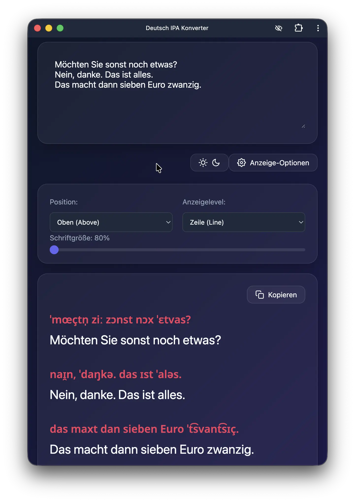

# Deutsch IPA Konverter

Online here: [de-ipa.pages.dev](https://de-ipa.pages.dev)

A simple web application for converting German text into phonetic IPA (International Phonetic Alphabet) transcription using a comprehensive dictionary of over 360,000 words.



## 🚀 Setup & Usage

### Installation as PWA

**Desktop (Chrome, Edge, Brave)**
1. Visit the website [de-ipa.pages.dev](https://de-ipa.pages.dev)
2. Click the install icon (⊕) in the address bar
3. Click "Install"

**Mobile (iOS Safari)**
1. Visit the website [de-ipa.pages.dev](https://de-ipa.pages.dev)
2. Tap the Share button
3. Tap "Add to Home Screen"

**Mobile (Android Chrome)**
1. Visit the website [de-ipa.pages.dev](https://de-ipa.pages.dev)
2. Tap the menu (⋮)
3. Tap "Add to Home Screen"


## ✨ Features
- **Accurate Transcription**: Powered by a large-scale German IPA dictionary.
- **Progressive Web App (PWA)**: Installable on desktop and mobile devices.
- **Offline Support**: Works without internet connection after first visit.
- **Copy to Clipboard**: One-click copying of IPA results.
- **Multiple Display Modes**:
    - **Word-by-Word**: IPA above or below individual words.
    - **Line-by-Line**: IPA for each line.
    - **Paragraph**: IPA for entire paragraphs.
- **Dark/Light Theme**: Toggle between themes with persistent preference.
- **Modern Design**: Glassmorphism-inspired UI with smooth transitions.
- **Real-time Conversion**: Transcribes as you type with intelligent debouncing.

---
## 🛠️ Development

### 1. Dictionary Generation
If you need to regenerate the JavaScript dictionary from the source CSV:

```bash
python3 csv_to_js.py
```

### 2. Running the Web App
Simply open `index.html` in your browser, or serve it using a local server:
```bash
npx http-server
```

## 📊 Data Source
The pronunciation data is sourced from the [German IPA Pronunciation Dictionary](https://www.kaggle.com/datasets/cdminix/german-ipa-pronunciation-dictionary) on Kaggle.

**License**: CC0: Public Domain.

---
Developed by Antigravity 🚀