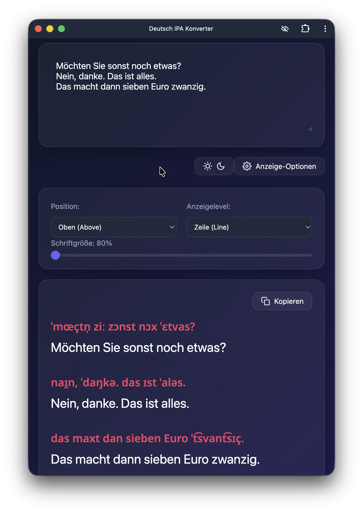

# Deutsch IPA Konverter

Online here: [de-ipa.pages.dev](https://de-ipa.pages.dev)

A simple web application for converting German text into phonetic IPA (International Phonetic Alphabet) transcription using a comprehensive dictionary of over 360,000 words.



## 🚀 Setup & Usage

### Installation as PWA

**Desktop (Chrome, Edge, Brave)**
1. Visit the website [de-ipa.pages.dev](https://de-ipa.pages.dev)
2. Click the install icon (⊕) in the address bar
3. Click "Install"

**Mobile (iOS Safari)**
1. Visit the website [de-ipa.pages.dev](https://de-ipa.pages.dev)
2. Tap the Share button
3. Tap "Add to Home Screen"

**Mobile (Android Chrome)**
1. Visit the website [de-ipa.pages.dev](https://de-ipa.pages.dev)
2. Tap the menu (⋮)
3. Tap "Add to Home Screen"


## ✨ Features
- **Accurate Transcription**: Powered by a large-scale German IPA dictionary.
- **Progressive Web App (PWA)**: Installable on desktop and mobile devices.
- **Offline Support**: Works without internet connection after first visit.
- **Copy to Clipboard**: One-click copying of IPA results.
- **Multiple Display Modes**:
    - **Word-by-Word**: IPA above or below individual words.
    - **Line-by-Line**: IPA for each line.
    - **Paragraph**: IPA for entire paragraphs.
- **Dark/Light Theme**: Toggle between themes with persistent preference.
- **Modern Design**: Glassmorphism-inspired UI with smooth transitions.
- **Real-time Conversion**: Transcribes as you type with intelligent debouncing.

---
## 🛠️ Development

### 1. Dictionary Generation
If you need to regenerate the JavaScript dictionary from the source CSV:

```bash
python3 csv_to_js.py
```

### 2. Running the Web App
Simply open `index.html` in your browser, or serve it using a local server:
```bash
npx http-server
```

## 📊 Data Source
The pronunciation data is sourced from the [German IPA Pronunciation Dictionary](https://www.kaggle.com/datasets/cdminix/german-ipa-pronunciation-dictionary) on Kaggle.

**License**: CC0: Public Domain.


### CMU Dictionary 
For cmudict.js

The latest `cmudict.dict` in [Arpabet](https://en.wikipedia.org/wiki/ARPABET) can be found via [Carnegie Mellon Pronouncing Dictionary](http://www.speech.cs.cmu.edu/cgi-bin/cmudict)


## IPA word stress ready

Instead of converting the Arpabet chars to IPA, we use the IPA list with word stress ready and Brown Corpus Frequency Word list from adapted from [menelik3/cmudict-ipa](https://github.com/menelik3/cmudict-ipa).


## Original CMU data license

```text 
Copyright (C) 1993-2015 Carnegie Mellon University. All rights reserved.

Redistribution and use in source and binary forms, with or without
modification, are permitted provided that the following conditions
are met:

1. Redistributions of source code must retain the above copyright
   notice, this list of conditions and the following disclaimer.
   The contents of this file are deemed to be source code.

2. Redistributions in binary form must reproduce the above copyright
   notice, this list of conditions and the following disclaimer in
   the documentation and/or other materials provided with the
   distribution.

This work was supported in part by funding from the Defense Advanced
Research Projects Agency, the Office of Naval Research and the National
Science Foundation of the United States of America, and by member
companies of the Carnegie Mellon Sphinx Speech Consortium. We acknowledge
the contributions of many volunteers to the expansion and improvement of
this dictionary.

THIS SOFTWARE IS PROVIDED BY CARNEGIE MELLON UNIVERSITY ``AS IS'' AND
ANY EXPRESSED OR IMPLIED WARRANTIES, INCLUDING, BUT NOT LIMITED TO,
THE IMPLIED WARRANTIES OF MERCHANTABILITY AND FITNESS FOR A PARTICULAR
PURPOSE ARE DISCLAIMED.  IN NO EVENT SHALL CARNEGIE MELLON UNIVERSITY
NOR ITS EMPLOYEES BE LIABLE FOR ANY DIRECT, INDIRECT, INCIDENTAL,
SPECIAL, EXEMPLARY, OR CONSEQUENTIAL DAMAGES (INCLUDING, BUT NOT
LIMITED TO, PROCUREMENT OF SUBSTITUTE GOODS OR SERVICES; LOSS OF USE,
DATA, OR PROFITS; OR BUSINESS INTERRUPTION) HOWEVER CAUSED AND ON ANY
THEORY OF LIABILITY, WHETHER IN CONTRACT, STRICT LIABILITY, OR TORT
(INCLUDING NEGLIGENCE OR OTHERWISE) ARISING IN ANY WAY OUT OF THE USE
OF THIS SOFTWARE, EVEN IF ADVISED OF THE POSSIBILITY OF SUCH DAMAGE.

```


---
